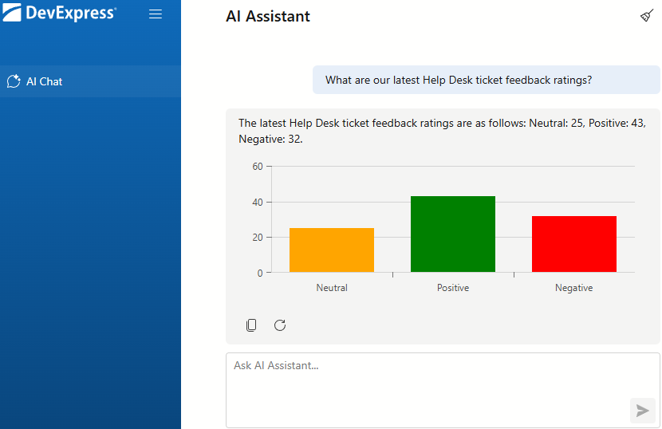

<!-- default badges list -->

[](https://supportcenter.devexpress.com/ticket/details/T1331917)
[](https://docs.devexpress.com/GeneralInformation/403183)
[](#does-this-example-address-your-development-requirementsobjectives)
<!-- default badges end -->
# Blazor AI Chat — Customize Tool Calling Result

DevExpress Blazor [AI Chat](https://docs.devexpress.com/Blazor/405290) can query live enterprise data using natural language. In this example, a custom AI tool returns structured help desk feedback data, and the chat UI displays the result as an inline chart.



The sample app relies on the following DevExpress Blazor components:

- [DxAIChat](https://docs.devexpress.com/Blazor/DevExpress.AIIntegration.Blazor.Chat.DxAIChat)
- [DxChart](https://docs.devexpress.com/Blazor/DevExpress.Blazor.Charts.DxChart)
- [DxChartBarSeries](https://docs.devexpress.com/Blazor/DevExpress.Blazor.Charts.DxChartBarSeries-3)
- [DxAIChatPromptSuggestion](https://docs.devexpress.com/Blazor/DevExpress.AIIntegration.Blazor.Chat.DxAIChatPromptSuggestion)

## Setup and Configuration

To run this sample, restore project dependencies and set up secure authentication for Azure OpenAI.

### Required Packages

We use the following versions of Microsoft AI packages in this project:

| NuGet Package                                                                                   | Version                 |
| ----------------------------------------------------------------------------------------------- | ----------------------- |
| [Microsoft.Extensions.AI](https://www.nuget.org/packages/Microsoft.Extensions.AI)               | 9.7.1                   |
| [Microsoft.Extensions.AI.OpenAI](https://www.nuget.org/packages/Microsoft.Extensions.AI.OpenAI) | 9.7.1-preview.1.25365.4 |
| [Azure.AI.OpenAI](https://www.nuget.org/packages/Azure.AI.OpenAI)                               | 2.3.0-beta.2            |

> [!NOTE]
> We cannot guarantee compatibility or correct execution with newer versions. Refer to the following announcement for additional information: [DevExpress.AIIntegration references stable versions of Microsoft.Extensions.AI packages](https://community.devexpress.com/blogs/aspnet/archive/2025/08/20/devexpress-aiintegration-references-stable-versions-of-microsoft-extensions-ai-packages.aspx).

### Register AI Services

> [!NOTE]
> DevExpress AI-powered extensions follow the "bring your own key" principle. DevExpress does not offer a REST API and does not ship any built-in LLMs/SLMs. You need an active Azure OpenAI subscription to obtain the REST API endpoint, key, and model deployment name. These variables must be specified at application startup to register AI clients and enable DevExpress AI-powered Extensions in your application.

This example uses the [Azure OpenAI](https://azure.microsoft.com/en-us/products/ai-foundry/models/openai) service.

Secrets are stored in [appsettings.json](CS/appsettings.json). Update the following section with your own credentials:

- `AzureOpenAISettings`
  - `Endpoint`: Your Azure OpenAI endpoint
  - `Key`: Your Azure OpenAI key
  - `DeploymentName`: Azure OpenAI [model ID](https://learn.microsoft.com/en-us/azure/ai-services/openai/concepts/models)

The following code in [Program.cs](CS/Program.cs) retrieves the Azure OpenAI configuration and registers the chat client with tool support:

```csharp
var openAiServiceSettings = builder.Configuration.GetSection("AzureOpenAISettings")
    .Get<AzureOpenAIServiceSettings>();

var azureOpenAIClient = new AzureOpenAIClient(
    new Uri(openAiServiceSettings.Endpoint),
    new AzureKeyCredential(openAiServiceSettings.Key));

var chatClient = azureOpenAIClient
    .GetChatClient(openAiServiceSettings.DeploymentName)
    .AsIChatClient();

builder.Services.AddScoped<IChatClient>((sp) => {
    return chatClient.AsBuilder()
        .UseDXTools()
        .UseFunctionInvocation()
        .Build(sp);
});

builder.Services.AddSingleton<HelpDeskDataService>();
builder.Services.AddScoped<HelpDeskAITools>();
builder.Services.AddDevExpressAI();
```

## Implementation Details

### Custom Tool Calling

The [HelpDeskAITools](CS/Services/HelpDeskAITools.cs) class defines the AI tool as an instance method, so it can use constructor-injected services ([HelpDeskDataService](#help-desk-data-service)) to fetch live data.  [Program.cs](CS/Program.cs) registers this AI tool as a scoped service. The tool's method returns structured `List<ChartReportData>`.

```csharp
[AIIntegrationTool(GetFeedbackChartToolName)]
[Description(GetFeedbackChartToolDescription)]
public List<ChartReportData> GetFeedbackChart(
    [Description(GetFeedbackChartToolFilterDescription)] string[] categories) {
    var summary = dataService.GetFeedbackSummary();

    if (categories != null && categories.Length > 0) {
        var filter = new HashSet<string>(categories, StringComparer.OrdinalIgnoreCase);
        summary = summary.Where(s => filter.Contains(s.Label)).ToList();
    }

    return summary;
}
```

The tool uses named feedback labels from [HelpDeskDataService.cs](CS/Services/HelpDeskDataService.cs) so the prompt and filtering logic stay in sync.

### Inline Chart Rendering

The [AI Chat](CS/Components/Pages/Index/Index.razor) component renders the assistant message inside [MessageContentTemplate](https://docs.devexpress.com/Blazor/DevExpress.AIIntegration.Blazor.Chat.DxAIChat.MessageContentTemplate), then reads the function call result from `BlazorChatMessage.FunctionCalls` and deserializes it into chart data.

```razor
<DxAIChat UseStreaming="true" ShowHeader="true">
    <MessageContentTemplate>
        @context.Content

        @if (TryGetChartData(context, out var chartData)) {
            <DxChart Data="@chartData" Width="100%" Height="300px"
                     CustomizeSeriesPoint="OnCustomizePoint">
                <DxChartBarSeries ArgumentField="@((ChartReportData d) => d.Label)"
                                  ValueField="@((ChartReportData d) => d.Value)"
                                  Name="Tickets" />
                <DxChartLegend Visible="false" />
            </DxChart>
        }
    </MessageContentTemplate>
</DxAIChat>
```


Bars are color-coded by feedback category using [CustomizeSeriesPoint](https://docs.devexpress.com/Blazor/DevExpress.Blazor.DxChartBase.CustomizeSeriesPoint): green for Positive, red for Negative, and orange for Neutral.

### Help Desk Data Service

[HelpDeskDataService.cs](CS/Services/HelpDeskDataService.cs) generates 100 randomized `HelpDeskTicket` records on startup (using a fixed seed for reproducibility) and exposes a `GetFeedbackSummary()` method. The service also defines shared label constants used by the tool and chart rendering logic.

### Prompt Suggestions

[Index.razor](CS/Components/Pages/Index/Index.razor) includes two [prompt suggestions](https://docs.devexpress.com/Blazor/DevExpress.AIIntegration.Blazor.Chat.DxAIChatPromptSuggestion) to guide users:

- **Feedback Chart** — asks for full feedback breakdown across all categories.
- **Positive vs. Negative Chart** — filters the chart to compare Positive and Negative ratings.

## Files to Review

- [Program.cs](CS/Program.cs)
- [appsettings.json](CS/appsettings.json)
- [Components/Pages/Index/Index.razor](CS/Components/Pages/Index/Index.razor)
- [Components/Pages/Index/Index.razor.css](CS/Components/Pages/Index/Index.razor.css)
- [Services/HelpDeskAITools.cs](CS/Services/HelpDeskAITools.cs)
- [Services/HelpDeskDataService.cs](CS/Services/HelpDeskDataService.cs)
- [Services/AzureOpenAIServiceSettings.cs](CS/Services/AzureOpenAIServiceSettings.cs)
- [Models/HelpDeskTicket.cs](CS/Models/HelpDeskTicket.cs)
- [Models/ChartReportData.cs](CS/Models/ChartReportData.cs)

## Documentation

- [DevExpress AI-powered Extensions for Blazor](https://docs.devexpress.com/Blazor/405228/ai-powered-extensions)
- [DevExpress Blazor AI Chat Control](https://docs.devexpress.com/Blazor/DevExpress.AIIntegration.Blazor.Chat.DxAIChat)
- [DevExpress Blazor Chart](https://docs.devexpress.com/Blazor/DevExpress.Blazor.Charts.DxChart)
- [AIIntegrationTool Attribute](https://docs.devexpress.com/Blazor/405228/ai-powered-extensions)
- [Microsoft.Extensions.AI IChatClient](https://learn.microsoft.com/en-us/dotnet/api/microsoft.extensions.ai.ichatclient)

## Related Examples

- [DevExpress Blazor AI Chat — Implement Function/Tool Calling](https://github.com/DevExpress-Examples/blazor-ai-chat-function-calling)
- [Blazor AI Chat — Confirm Tool Calls](https://github.com/DevExpress-Examples/blazor-ai-chat-confirm-tool-calls)
<!-- feedback -->
## Does This Example Address Your Development Requirements/Objectives?

[](https://www.devexpress.com/support/examples/survey.xml?utm_source=github&utm_campaign=blazor-ai-chat-customize-tool-call-result&~~~was_helpful=yes) [](https://www.devexpress.com/support/examples/survey.xml?utm_source=github&utm_campaign=blazor-ai-chat-customize-tool-call-result&~~~was_helpful=no)

(you will be redirected to DevExpress.com to submit your response)
<!-- feedback end -->
